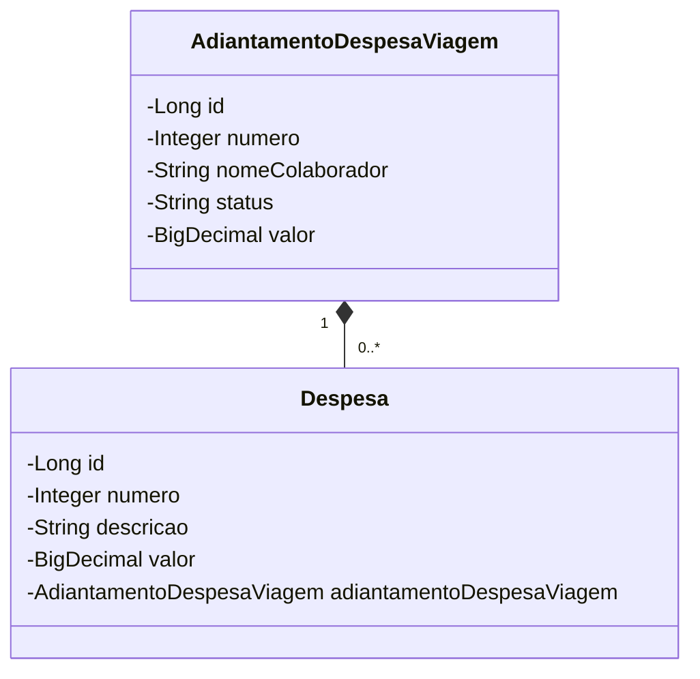

# API  (Adiantamento de Despesa de Viagem)

- Essa é uma API Java RESTFul, que foi desenvolvida simulando um cenário onde as organizações/empresas disponibilizam recursos financeiros
  para seus colaboradores viajarem (a trabalho), custeando assim despesas com hotéis, refeições, locomoção, etc.
  Isso possibilita que essas despesas sejam lançadas e armazenadas na base de dados para enventuais auditorias.

 - [Visite a API via Swagger clicando aqui](http://api-adv.up.railway.app/swagger-ui.html)

## Tecnologias utilizadas

- Java 17
- Git/GitHub
- Spring Boot 3
- Spring Web
- Spring Data JPA
- H2 (Banco de dados em memória para desenvolvimento)
- Postgres
- OpenAPI (Swagger)
- Railway
  
## Diagrama de classe 

