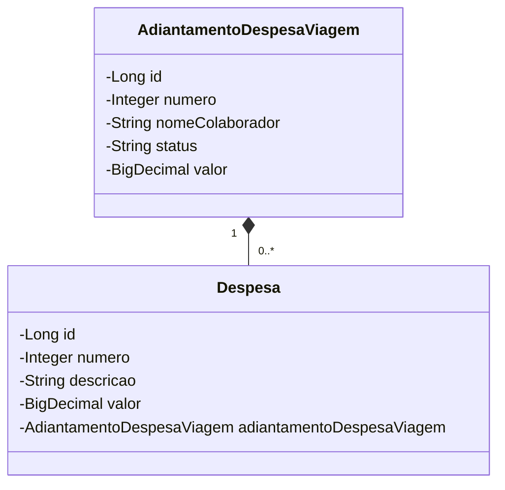

# API  (Adiantamento de Despesa de Viagem)

- Essa é uma API de estudo desenvolvidda com Spring Boot 3 e seus starters (Spring Web, Spring Data JPA) aplicando as premissas de IoC (Inversão de Controle) e Injeção de Dependência.
 API RESTFul, seguindo os principios do paradgma orientado a objetos, testada e documentada utilizando OpenAPI(Swagger)

## Diagrama de classe 

