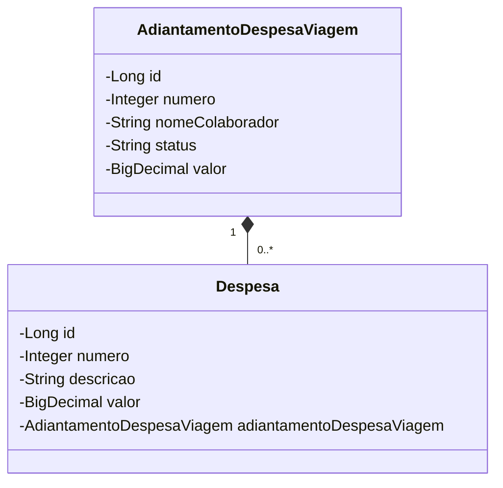

#  REST - API  (Adiantamento de Despesa de Viagem)

- Esse é um projeto de estudo de uma API RESTFul de acordo com o seguinte cenário:

## Diagrama de classe 

```mermaid
classDiagram
    class AdiantamentoDespesaViagem {
        -Long id
        -Integer numero
        -String nomeColaborador
        -String status
        -BigDecimal valor
    }

    class Despesa {
        -Long id
        -Integer numero
        -String descricao
        -BigDecimal valor
        -AdiantamentoDespesaViagem adiantamentoDespesaViagem
    }

 AdiantamentoDespesaViagem "1" *-- "0..*" Despesa

```

